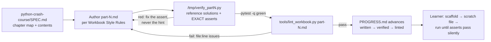

# ARCHITECTURE.md — How It's Built

> The **how**. Read before touching a component boundary, a data contract, or a
> stage interface. If a change alters anything here, update this file *before*
> writing the code, and record the change in `wiki/`.
>
> **Read by section, not whole.** Jump to the heading you need:
> System Overview · Data Flow · Components · Contracts · Technology Choices ·
> Boundaries · Failure Modes.

**Last reviewed:** 2026-07-01

---

## System Overview

The product is documentation: a workbook under `python-crash-course/` whose
part files are authored against a content spec, forced through a mechanical
quality pipeline, and tracked in a state file. Around it sits the anti-drift
layer (root CLAUDE.md/ANCHOR/STATE/wiki + SessionStart hook) that keeps
multi-session authoring aligned. The workbook directory is itself a real
src-layout Python project so the tooling it teaches runs for real.

## Data Flow

Along the edges: markdown part files (authoring), a throwaway pytest file in
/tmp (verification — deleted after, never committed), `file:line` diagnostics
(lint), and one-line state entries (PROGRESS.md).

---

## Components

### Part files (`python-crash-course/part-0..7.md`)
- **Responsibility:** deliver concepts + exercises for their chapter range only.
- **Inputs / Outputs:** chapter contents from `python-crash-course/SPEC.md` in;
  concept snippets and exercise blocks (see Contracts) out.
- **Owns:** their chapter range per the FILE → CHAPTER MAP; nothing else's.
- **Must not:** contain solutions (RUL-0001), exceed the size guardrail,
  re-teach earlier idioms, or repeat Part 0 structure (ch 14/15/18 reference back).
  part-1.md is the exemplar: never edited once dropped in.

### Content spec (`python-crash-course/SPEC.md`)
- **Responsibility:** authoritative chapter map, per-chapter topics,
  pre-decided choices, exercise types, verification gate.
- **Inputs / Outputs:** decisions in (via edits + DEC records); constraints out
  to every authoring session.
- **Owns:** content-level authority; the root SPEC.md owns project-level intent.
- **Must not:** be duplicated into part files or the root SPEC.

### Lint gate (`python-crash-course/tools/lint_workbook.py`)
- **Responsibility:** mechanical enforcement of the Workbook Style Rules.
- **Inputs / Outputs:** part-file paths in; `file:line: message` diagnostics
  and exit code (1 = fail) out.
- **Owns:** the machine-readable copy of the FILE → CHAPTER MAP
  (`CHAPTER_RANGES`) — keep in sync with the content spec.
- **Must not:** use non-stdlib imports; auto-fix files; be weakened to make a
  part pass (fix the part, or fix the rule via a DEC).

### Running example (`python-crash-course/pyproject.toml` + `src/crash_course/`)
- **Responsibility:** the real project Part 0 teaches from (DEC-0006).
- **Inputs / Outputs:** none at runtime; exists to be read and to keep
  `ruff check .` / `mypy src` / `pytest` meaningful.
- **Owns:** packaging/tooling config for the workbook directory.
- **Must not:** grow application logic; it stays a stub teaching prop.

### Progress tracker (`python-crash-course/PROGRESS.md`)
- **Responsibility:** single source for each part's pipeline state.
- **Inputs / Outputs:** gate results in; `pending → written → verified → linted`
  per part out.
- **Must not:** advance a part that hasn't passed the gate (RUL-0002).

### Anti-drift layer (root `CLAUDE.md`, `ANCHOR.md`, `STATE.md`, `wiki/`, `.claude/`)
- **Responsibility:** keep multi-session authoring aligned with the North Star,
  locked decisions, and current focus.
- **Inputs / Outputs:** decisions/state in; injected context (SessionStart
  hook), `/reground`, and the wiki index out.
- **Owns:** all process rules. The root CLAUDE.md is the only operating
  contract (RUL-0003).
- **Must not:** hold volatile state in ANCHOR.md, or content rules anywhere
  but the root CLAUDE.md's Workbook Style Rules section.

---

## Contracts / Interfaces

> The shapes that pass between components. Changing one of these is a
> decision-worthy event.

- **Concept snippet:** fenced python block outside an Exercise block; ≥1
  grounding comment; ≤2 sentences of adjacent prose; parses as 3.11+.
- **Function-building exercise:** `**Exercise N.x**` block; first fence has a
  `def`/`class` scaffold with `...`; a `# hint:` naming a technique; ≥1
  `assert`; scaffold body ≤2 statements besides docstring/`...`.
- **Refactor exercise:** `**Exercise N.x**` block; no scaffold; a "rewrite"
  instruction comment; assert-exempt (CON-0001).
- **Lint diagnostic:** `path:line: message` on stdout; exit 0 clean / 1 issues.
- **PROGRESS.md entry:** `part-N: pending|written|verified|linted` (RUL-0002
  gates each advance).
- **Wiki record:** `CON-|RUL-|DEC-XXXX.md` with the frontmatter its
  `_TEMPLATE-*.md` defines; `build_index.py` parses it into INDEX.md.

## Technology Choices

| Concern | Choice | Status | Rationale |
|---------|--------|--------|-----------|
| Python floor | 3.11+ (modern idioms only) | locked | see DEC-0001/DEC-0006; workbook teaches current Python |
| Build backend | hatchling, src layout | locked | see DEC-0006 |
| Toolchain | ruff + mypy + pytest as `dev` extra | locked | see DEC-0006 |
| Lint gate | stdlib-only script (`ast`, `re`, `argparse`) | locked | see DEC-0005; zero-dependency gate |
| ch17 testing | pytest only, no plugins | locked | `python-crash-course/SPEC.md` PRE-DECIDED |
| ch21 data | stdlib only (json, csv, sqlite3) | locked | `python-crash-course/SPEC.md` PRE-DECIDED |
| ch22 web | FastAPI + in-process TestClient | locked | `python-crash-course/SPEC.md` PRE-DECIDED |

## Boundaries & Invariants

- Course content lives only under `python-crash-course/`; process/anti-drift
  docs live only at the root. Root SPEC = intent; workbook SPEC = content.
- Reference solutions exist only in `/tmp` during verification — never in the
  tree (RUL-0001).
- The lint gate checks; it never edits. Authors fix the part file (or the
  assert — never leak into a hint).
- Chapters reference earlier material (Part 0, earlier idioms); they never
  re-define it.
- ANCHOR.md ≤ one screen; volatile state only in STATE.md.

## Failure Modes

- **Verification red** → the assert is wrong or unachievable: fix the assert in
  the part file; never compensate in a hint (DEC-0005).
- **Lint fail** → fix the part file at the reported `file:line`; weakening the
  linter requires a DEC record first.
- **Context compaction / session start** → the SessionStart hook injects
  Current Focus; run `/reground` before resuming — never resume from memory
  (part-1.md style memory is presumed stale; reread it in full).
- **Conflicting instructions discovered** → stop and flag per the Drift
  Self-Check; a nested CLAUDE.md is always a violation (RUL-0003).
