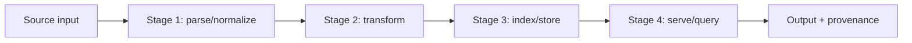

# PROMPT — Recreate the Anti-Drift Context + Wiki System for a Claude Code Project

> Hand this entire document to another Claude. It is self-contained: it does not
> depend on any prior conversation. Following it should reproduce the same system
> and then help the user fill it for their specific project.

---

## Your task

Set up a documentation + automation scaffold inside a Claude Code project. Its
purpose: keep development grounded on a fixed specification, architecture, and set
of decisions across many sessions — despite context compaction and `/clear`.

Reproduce the files in **CANONICAL FILE CONTENTS** below **exactly** (they are the
deliverable), create the directory structure, wire up the automation, then guide
the user through filling the placeholders for their project. The `<TODO …>` markers
are intentional fill points — keep them as placeholders; do not invent project
specifics unless the user asks.

Default assumption: a **solo, mid-size project**, commonly in the AI-infrastructure
domain (RAG tools, AI processing pipelines, AI automation). The scaffold is
domain-neutral; adapt the examples if the user's domain differs.

---

## The problem this solves

Over a long project, Claude drifts from the original concept after several sessions
and after context compaction. Root causes:

- **Compaction is lossy summarization.** When context fills (auto-compact triggers
  late — version-dependent, roughly 77–95% utilization), the oldest/foundational
  material is compressed first and recent tool output is kept over the founding
  concept — exactly inverting what matters.
- **Rejected ideas are rarely recorded**, so a fresh session cheerfully
  re-proposes an approach that was already considered and killed. Likewise,
  concepts get re-explained inconsistently and informal rules silently lapse.
- **A bloated `CLAUDE.md` gets skimmed** and loses its force as an anchor.

## Grounded Claude Code mechanics the design relies on (verify if unsure)

- `CLAUDE.md` auto-loads every session and reloads even after `/clear`. It is the
  one durable anchor — so it must stay short and authoritative.
- You can place **compaction-preservation instructions** in `CLAUDE.md`, and
  `/compact <instructions>` steers what survives. Best practice: compact
  **proactively around 60%**, not at the auto-trigger (version-dependent, ~77–95%).
  Setting `CLAUDE_AUTOCOMPACT_PCT_OVERRIDE=60` makes the proactive threshold
  automatic instead of relying on watching the context bar.
- `@path` imports in `CLAUDE.md` pull a file's content into the always-loaded
  context. Use sparingly — every import costs context on every session.
- **SessionStart hooks** are configured in project `.claude/settings.json`. For the
  SessionStart event, plain **stdout on exit 0 is injected into context** (no JSON
  wrapper needed). Since Claude Code 2.1.0 the injection is **silent** — Claude sees
  it but it is not shown in the user-visible transcript. Known caveat: the same hook
  defined inside a *plugin's* `hooks.json` may fail to surface `additionalContext`
  (open reliability issues also affect the JSON `additionalContext` path generally)
  — keep it a **project** hook emitting plain stdout.
- **Slash commands** are markdown files in `.claude/commands/`; the body is the
  prompt and `$ARGUMENTS` is substituted at call time.

## Objectives / design principles

1. **Thin always-loaded anchor; everything else retrieved on demand.** Optimize the
   *context-window* cost, not disk size. Files on disk are free until read.
2. **Match format to access pattern.** Markdown for prose (cheaper and more reliable
   for models than JSON). Structure (per-record files, frontmatter) only for things
   you query or fetch one at a time. Do not convert prose to JSON/YAML — it adds
   tokens and hurts.
3. **Record knowledge, not just code** — a project wiki of typed records:
   **concepts** (CON-), binding **rules** (RUL-), and **decisions** (DEC-),
   where a rejected idea is a decision with status `Rejected`. Append-only,
   with rationale. The Rejected Ideas section is what prevents dead ideas from
   resurfacing; the rules are what an agent can self-check against.
4. **Keep the anchor skimmable** (≤ ~1 screen). If it can't be skimmed in under a
   minute, it's too long — push detail into the on-demand docs and leave a pointer.
5. **Make re-grounding a ritual** at session start and after compaction, via a
   `/reground` command and a SessionStart hook.
6. **Scale storage to need:** flat files → SQLite + FTS5 keyword search →
   embeddings (only past ~50–100 records or when querying by concept) → an MCP
   server exposing `get_/search_/append_` tools (the most agent-friendly endpoint,
   worth it only once flat files genuinely hurt). For a solo mid-size project, flat
   files plus the per-record wiki split below is sufficient.

## Target file tree

```
CLAUDE.md                  # rules + `@ANCHOR.md` import; auto-loads, survives /clear
ANCHOR.md                  # north star + locked decisions ONLY (≤ 1 screen)
STATE.md                   # volatile session state; read whole; hook injects Current Focus
SPEC.md                    # the what/why; read by section (has a TOC)
ARCHITECTURE.md            # the how; read by section (has a TOC)
GLOSSARY.md                # canonical terms
WORKFLOW.md                # event -> prompt -> action trigger manual
SETUP.md                   # bootstrap guide (new + existing projects)
wiki/
  INDEX.md                 # AUTO-GENERATED, grouped: Concepts / Rules / Decisions / Rejected Ideas
  _TEMPLATE-concept.md     # copy to start a concept (CON-XXXX)
  _TEMPLATE-rule.md        # copy to start a binding rule (RUL-XXXX)
  _TEMPLATE-decision.md    # copy to start a decision (DEC-XXXX; status Rejected = rejected idea)
  CON-0001.md              # example concept
  RUL-0001.md              # example rule
  DEC-0001.md              # example decision: Accepted
  DEC-0002.md              # example rejected idea (decision, status Rejected)
  build_index.py           # regenerates INDEX.md from frontmatter (no deps)
.claude/
  settings.json            # registers the SessionStart hook
  hooks/session-start.sh   # injects Current Focus + branch at startup
  commands/reground.md     # /reground re-anchor command
```

## How the pieces interlock

- `CLAUDE.md` (always loaded) imports `ANCHOR.md` (north star + locked decisions) and
  states the rules: on-demand retrieval, compaction directives, session protocol,
  drift self-check.
- **Volatile** state (the current task) lives only in `STATE.md`, injected at startup
  by the SessionStart hook — so it is never duplicated in the anchor.
- The **wiki is split one-file-per-record** with YAML frontmatter — concepts
  (`CON-XXXX.md`), binding rules (`RUL-XXXX.md`), and decisions (`DEC-XXXX.md`;
  a rejected idea is a DEC with status `Rejected`) — plus a generated `INDEX.md`
  grouped into Concepts / Rules / Decisions / Rejected Ideas. Agents read the
  tiny index, then fetch only the single record they need — so the wiki scales
  without any read growing.
- `SPEC.md` / `ARCHITECTURE.md` are read **by section** (each has a TOC), never bulk-read.

## Build sequence

1. Create the tree (`mkdir -p wiki .claude/commands .claude/hooks`).
2. Write every file from **CANONICAL FILE CONTENTS** verbatim.
3. `chmod +x .claude/hooks/session-start.sh wiki/build_index.py`.
4. Run `python3 wiki/build_index.py` — it should regenerate `wiki/INDEX.md`
   (and `python3 wiki/build_index.py --test` should print `self-test OK`).
5. Dry-run `bash .claude/hooks/session-start.sh` — it should print the Current Focus
   section of `STATE.md` plus the git branch.
6. Then help the user fill placeholders in priority order (see "Adapting", below).

## Examples (expected behavior)

The four seed records demonstrate one of each kind — a concept, a rule, an
Accepted decision, and a Rejected one — and the generator groups their
frontmatter into a sectioned index:

```
# WIKI INDEX — Concepts · Rules · Decisions · Rejected Ideas
## Concepts
| CON-0001 | Chunk | pipeline, retrieval | 2026-01-15 | The unit of text that gets embedded and retrieved… |
## Rules (binding — do not violate)
| RUL-0001 | Inter-stage data passes only through the typed schema | pipeline, schema | 2026-01-15 | No raw dicts across stage boundaries… |
## Decisions
| DEC-0001 | Typed intermediate format between pipeline stages | Accepted | pipeline, schema | 2026-01-15 | … |
## Rejected Ideas — do not re-propose
| DEC-0002 | Passing raw dicts between stages | pipeline, schema | 2026-01-15 | Rejected — untyped payloads invite silent field drift. |
```

The SessionStart hook dry-run prints the `## Current Focus` block from `STATE.md`,
the active git branch, and a reminder to re-read `CLAUDE.md` + `STATE.md` and check
`wiki/INDEX.md` before proposing approaches.

## Verification (after build)

- `@ANCHOR.md` resolves — ask Claude to recite the north star without pasting it.
- The hook injects Current Focus + branch in a fresh session (silently since
  Claude Code 2.1.0 — verify by asking Claude to state them without reading files).
- `/reground` reads ANCHOR -> STATE -> wiki and restates the binding constraints.
- `build_index.py` re-runs cleanly and the index matches the records present
  (rejected DECs appear under Rejected Ideas).

## Adapting to the target project (fill order matters)

Fill in priority order, not all at once — **ANCHOR and STATE are what actually fight
drift**; the rest is backfill that needn't be perfect on day one.

1. **ANCHOR.md** — north star + anti-scope. New project: write from intent. Existing
   project: reverse-engineer from the code, then correct against true intent (the
   mismatches mark where it already drifted).
2. **Locked Decisions + seed wiki records** — capture only what's expensive to
   reverse or what an agent might unknowingly violate: DEC files for choices
   (including remembered rejections), RUL files for standing constraints; for
   existing repos, backfill the implicit ones baked into the code.
3. **SPEC.md** — for existing repos, the high-value parts to write by hand are the
   **Non-Goals** and **NFR targets** (rarely written down, first to erode).
4. **ARCHITECTURE.md** — document the *actual* architecture; let Claude draft from
   code, then verify boundaries.
5. **GLOSSARY.md + concepts** — the few overloaded/ambiguous terms; give any
   that need more than one line a `wiki/CON-XXXX.md` page.
6. **STATE.md Current Focus** — the task in flight right now.

For existing projects: let Claude draft docs from the code, but **always verify** —
reverse-engineered docs that quietly contradict reality are worse than none, because
the agent will trust them and drift *toward* the error.

---

## CANONICAL FILE CONTENTS

> Reproduce each of the following files verbatim at the indicated path. Outer fences
> use four backticks so any triple-backtick blocks inside a file are preserved.

### FILE: `CLAUDE.md`

````markdown
# CLAUDE.md

> Auto-loads every session; survives `/clear` and compaction. This is the
> **operating contract**. Keep it skimmable in under 60 seconds.
> Project invariants live in ANCHOR.md (imported just below); volatile state
> lives in STATE.md (injected by the SessionStart hook).

@ANCHOR.md

---

## Canonical Documents — retrieve on demand, never `cat` whole

| Doc | Read it when | How to read |
|-----|--------------|-------------|
| `SPEC.md` | Adding/changing a capability | by section (see its TOC) |
| `ARCHITECTURE.md` | Touching a boundary / contract / data flow | by section (see its TOC) |
| `wiki/INDEX.md` | **Before proposing any approach** | read index, then the one record |
| `wiki/<id>.md` | You need a concept, rule, or decision in full | single file |
| `STATE.md` | Start of every session | whole (it's small) |
| `GLOSSARY.md` | A term is ambiguous or you're naming something | lookup |

**Retrieval rule:** grep/section-read, don't bulk-read. For SPEC/ARCHITECTURE,
open only the heading you need. For the wiki, read `wiki/INDEX.md` first, then
fetch the single relevant record (`CON-`, `RUL-`, or `DEC-XXXX.md`). This keeps
context lean as the project grows.

---

## Compaction Directives

When compacting (auto or manual), preserve verbatim where possible:
1. The North Star and the full Locked Decisions list (from ANCHOR.md).
2. The Current Focus section of STATE.md.
3. Files modified this session and any test/run commands.
4. Unresolved open questions and blockers.

Discard freely: verbose tool output, full file dumps already on disk, and
exploratory tangents that changed no decision.

---

## Session Protocol

**Start:** run `/reground` (or rely on the SessionStart hook, which injects the
Current Focus). Restate the North Star, today's binding constraints, and the
current task before writing code.

**After any compaction / if context feels off:** run `/reground` before continuing.
Do not resume from memory alone.

**Decision made, idea rejected, or new concept/rule established:** create the
`wiki/` record from the matching `_TEMPLATE-*.md`, then run
`python3 wiki/build_index.py` to refresh the index — before moving on.

**End:** update STATE.md (done / in-progress / next / open questions / blockers /
files touched / run commands). Promote any now-permanent decision into ANCHOR.md's
Locked Decisions list.

---

## Drift Self-Check (before implementing anything)

- Conflicts with the North Star or a Locked Decision? → **stop and flag.**
- Re-introduces an idea from `wiki/INDEX.md`'s **Rejected Ideas**? → **stop and flag.**
- Violates a binding `RUL-XXXX` rule? → **stop and flag.**
- Expands scope beyond SPEC.md? → **stop and ask.**

If unsure which decision applies, ask rather than guess. A wrong assumption that
compounds across sessions is the failure mode this file exists to prevent.
````

### FILE: `ANCHOR.md`

````markdown
# ANCHOR.md — Always in Context

> The only project content loaded by default (pulled into CLAUDE.md via `@ANCHOR.md`).
> **Hard cap: one screen.** If it grows, push detail into SPEC / ARCHITECTURE /
> decisions and leave a one-line pointer here. Volatile state (current task) lives
> in STATE.md and is injected by the SessionStart hook — keep it out of this file.

## North Star

**Purpose (one sentence):**
<TODO: e.g. "A reproducible RAG ingestion + retrieval service turning scientific
PDFs into citation-grounded answers.">

**This is NOT:**  *(anti-scope — drift violates these first)*
- <TODO: e.g. "a general chatbot / model-training framework">
- <TODO: e.g. "multi-tenant SaaS — single-user, local-first for now">

## Locked Decisions (Invariants)

> Non-negotiable. Do not contradict or re-open without an explicit instruction to
> do so. Each links to its full rationale in `wiki/<id>.md`.

- [LOCKED] <TODO: one line> — DEC-0001
- [LOCKED] <TODO: one line> — DEC-0003
````

### FILE: `STATE.md`

````markdown
# STATE.md — Current State & Handoff

> Read at the **start** of every session; rewrite at the **end** of every session.
> This is your fast recovery point after `/clear` or compaction. Keep it current
> over comprehensive — stale state is worse than none.

**Last updated:** <YYYY-MM-DD HH:MM>
**Active branch / worktree:** <TODO>

---

## Current Focus

> The ONE thing in flight right now. One or two sentences. This is the line the
> compaction directives are told to preserve verbatim.

<TODO: e.g. "Implementing the chunker (FR-1). Schema agreed in DEC-0001; need
offset-preservation before embedding.">

## Done (recent, relevant)

- [x] <TODO>

## In Progress

- [ ] <TODO> — <where it stands, what's left>

## Next

- [ ] <TODO>
- [ ] <TODO>

## Open Questions

- [ ] <TODO: needs a decision → becomes a wiki/DEC-XXXX.md entry>

## Blockers

- <TODO: anything stopping forward progress, or "none">

## Files touched this session

- <path> — <what changed>

## Run / test commands

```bash
<TODO: the commands needed to verify the current work>
```
````

### FILE: `SPEC.md`

````markdown
# SPEC.md — Source of Truth for Intent

> The **what** and **why**. When code and this document disagree, this document
> wins (or this document is wrong and must be updated first, explicitly).
> Update via a normal edit; significant changes should also add a `wiki/DEC-XXXX.md` entry.
>
> **Read by section, not whole.** Jump to the heading you need:
> Problem · Purpose · Consumers · Functional Requirements · Non-Functional
> Requirements · Success Criteria · Non-Goals · Open Questions.

**Last reviewed:** <YYYY-MM-DD>

---

## Problem

<TODO: What concrete pain does this solve? Who hits it, how often, and what does
the current (bad) workaround look like?>

## Purpose & Outcome

<TODO: The guaranteed outcome when this works. One paragraph.>

## Consumers / Interfaces

<TODO: Who or what calls this? CLI? Library import? HTTP API? Another pipeline
stage? List each entry point and who depends on it.>

---

## Functional Requirements

> Number these so decisions and code can reference them (FR-1, FR-2 …).

- **FR-1:** <TODO: e.g. "Ingest a PDF and emit a typed document with ordered blocks.">
- **FR-2:** <TODO: e.g. "Retrieve top-k chunks with source + character offsets.">
- **FR-3:** <TODO: e.g. "Every generated answer cites the chunks it used.">

## Non-Functional Requirements

> For AI infra these are usually where quality lives. Be quantitative.

- **Accuracy / quality:** <TODO: e.g. "retrieval recall@10 ≥ 0.85 on the eval set">
- **Latency:** <TODO: e.g. "p95 query < 2s on the reference machine">
- **Cost / token budget:** <TODO: e.g. "≤ $X per 1k documents ingested">
- **Reproducibility:** <TODO: e.g. "same input + pinned models ⇒ identical chunk IDs">
- **Provenance:** <TODO: e.g. "every artifact traceable to source + pipeline version">
- **Resource limits:** <TODO: e.g. "must run within <N> GB VRAM / RAM">

## Success Criteria (Definition of Done)

<TODO: The observable signals that say "this works." Tie each to an FR/NFR and,
where possible, to an eval the project can run.>

- [ ] <criterion 1>
- [ ] <criterion 2>

---

## Non-Goals (Anti-Scope)

> Explicitly out of scope. Re-state the most tempting ones; these are the
> features that quietly creep in across sessions.

- <TODO: e.g. "No fine-tuning — we consume models, we don't train them.">
- <TODO: e.g. "No UI beyond a CLI for now.">
- <TODO: e.g. "No horizontal scaling / distributed workers in v1.">

## Open Questions

> Unresolved spec-level questions. Resolving one usually produces a `wiki/DEC-XXXX.md` entry.

- [ ] <TODO: open question>
````

### FILE: `ARCHITECTURE.md`

````markdown
# ARCHITECTURE.md — How It's Built

> The **how**. Read before touching a component boundary, a data contract, or a
> stage interface. If a change alters anything here, update this file *before*
> writing the code, and record the change in `wiki/`.
>
> **Read by section, not whole.** Jump to the heading you need:
> System Overview · Data Flow · Components · Contracts · Technology Choices ·
> Boundaries · Failure Modes.

**Last reviewed:** <YYYY-MM-DD>

---

## System Overview

<TODO: 2–4 sentences. What are the major pieces and how do they relate at the
highest level?>

## Data Flow

> Replace this illustrative pipeline with the real one. A Mermaid diagram keeps
> it readable and diffable.



<TODO: describe what flows along each edge and in what format.>

---

## Components

> One short block per component. Keep boundaries explicit — boundaries are what
> drift erodes first.

### <Component A>
- **Responsibility:** <single responsibility — if you need "and", consider splitting>
- **Inputs / Outputs:** <typed contract in / out>
- **Owns:** <state / files / resources it is responsible for>
- **Must not:** <things this component is forbidden to do — e.g. "must not call the network">

### <Component B>
- **Responsibility:**
- **Inputs / Outputs:**
- **Owns:**
- **Must not:**

---

## Contracts / Interfaces

> The shapes that pass between components. Changing one of these is a
> decision-worthy event.

- <TODO: e.g. "ParsedDoc: { id, source_uri, blocks: Block[], pipeline_version }">
- <TODO: e.g. "RetrievalResult: { chunk_id, text, source_uri, offset, score }">

## Technology Choices

> What is used and — briefly — why. Each locked choice links to its `wiki/DEC-XXXX.md` entry.

| Concern | Choice | Status | Rationale |
|---------|--------|--------|-----------|
| <e.g. orchestration> | <TODO> | locked / provisional | see DEC-00xx |
| <e.g. vector store> | <TODO> | locked / provisional | see DEC-00xx |
| <e.g. embedding model> | <TODO> | locked / provisional | see DEC-00xx |

## Boundaries & Invariants

- <TODO: e.g. "Core library is pure; all I/O and model calls are injected at the edges.">
- <TODO: e.g. "No stage mutates another stage's output in place.">

## Failure Modes

> How it degrades and what is expected to happen. Important for pipelines.

- <TODO: e.g. "Embedding model OOM → fail the batch, checkpoint progress, do not corrupt the store.">
- <TODO: e.g. "Malformed source → skip with logged provenance, never silently drop.">
````

### FILE: `GLOSSARY.md`

````markdown
# GLOSSARY.md — Canonical Terms

> One canonical name per concept. When you're about to name a new thing, check
> here first; add the term here the moment it's coined. Naming drift across
> sessions ("chunk" vs "segment" vs "passage") quietly fractures a codebase.
> If a term needs more than one line, give it a `wiki/CON-XXXX.md` concept page
> and link it from its row here.

| Term | Canonical meaning | Not to be confused with |
|------|-------------------|-------------------------|
| <e.g. Chunk> | <the unit of text that gets embedded and retrieved> | a layout Block (pre-chunking) |
| <e.g. Block> | <a typed layout element from parsing, before chunking> | a Chunk |
| <e.g. Provider> | <an injected adapter for an external model/service> | the model itself |
| <TODO> | <definition> | <ambiguity to avoid> |

---

## Naming conventions

- <TODO: e.g. "Pipeline stages are verbs (parse, chunk, embed, retrieve).">
- <TODO: e.g. "Data shapes are nouns in PascalCase (ParsedDoc, RetrievalResult).">
- <TODO: e.g. "Config keys are snake_case and namespaced by stage.">
````

### FILE: `WORKFLOW.md`

````markdown
# WORKFLOW.md — Triggers, Prompts & Actions

> Operating manual for the split layout. Each row is **event → prompt → action**.
> Goal: make re-grounding a reflex. Files referenced:
> `ANCHOR.md` (always loaded) · `CLAUDE.md` (rules) · `STATE.md` (volatile) ·
> `SPEC.md` / `ARCHITECTURE.md` (read by section) · `wiki/INDEX.md` + per-record `wiki/` files (CON-/RUL-/DEC-).

---

## Session lifecycle

### ▶ Session start — *re-ground*
**Event:** opening a new session / new day. The SessionStart hook auto-injects
the Current Focus; run the command to fully re-anchor.
**Prompt:** `/reground`
**Action:** reads ANCHOR + STATE + wiki index, restates north star, binding
constraints, and current task before any code.

### ■ Session end — *handoff*
**Event:** wrapping up.
**Prompt:**
> "Update STATE.md: done / in-progress / next / open questions / blockers / files
> touched / run commands. If any decision became permanent, promote it into
> ANCHOR.md's Locked Decisions list."

**Action:** writes the recovery point the next session (and the hook) reads.

---

## Context-pressure events

### ⟳ Approaching ~60% context — *proactive compaction*
**Event:** context bar near 60%. Don't wait for the auto-trigger — it fires late
(version-dependent, roughly 77–95% utilization). To make proactive compaction
automatic, set `CLAUDE_AUTOCOMPACT_PCT_OVERRIDE=60` instead of watching the bar.
**Prompt:**
> "/compact Preserve the North Star, all Locked Decisions, the Current Focus from
> STATE.md, files modified this session, and the test commands. Drop verbose tool
> output and resolved tangents."

**Action:** lossy summary that keeps the foundation, not the noise.

### ⟲ After compaction / context feels off — *re-anchor*
**Event:** just compacted, or Claude contradicts earlier work.
**Prompt:** `/reground`
**Action:** rebuilds alignment from disk instead of degraded memory.

### ✖ Context poisoned — *hard reset*
**Event:** Claude keeps reverting to a wrong assumption despite correction.
**Sequence:** update STATE.md → `/clear` → `/reground`
**Action:** clean slate; CLAUDE.md + `@ANCHOR.md` reload automatically, the hook
re-injects Current Focus, `/reground` restores intent.

---

## Per-document triggers

### ANCHOR.md — *invariant promotion*
**Event:** a decision becomes truly non-negotiable.
**Prompt:**
> "Promote DEC-XXXX to ANCHOR.md's Locked Decisions with a one-line summary + link.
> Keep ANCHOR.md under one screen — detail stays in the DEC file."

### SPEC.md — *scope guard* (read by section)
**Event:** about to add or change a capability.
**Prompt:**
> "Read only the relevant section of SPEC.md. Is <X> in scope or a Non-Goal? If it
> expands scope, stop and flag before implementing."

### ARCHITECTURE.md — *boundary guard* (read by section)
**Event:** a change touches a component boundary, contract, or data flow.
**Prompt:**
> "Read the relevant ARCHITECTURE.md section. Does this alter a boundary or contract?
> If so, propose the ARCHITECTURE.md edit first, then the code."

### wiki/ — *knowledge capture & rejection guard*
**Event A — proposing an approach:**
> "Read wiki/INDEX.md. Has <X> or a near-variant already been Accepted or
> Rejected? Open the specific DEC file before deciding."

**Event B — a decision is made:**
> "We chose <X> over <Y> because <Z>. Create wiki/DEC-XXXX.md from
> wiki/_TEMPLATE-decision.md (status Accepted, include the rejected alternative
> and rationale), then run `python3 wiki/build_index.py`."

**Event C — an idea is killed:**
> "We're rejecting <approach>. Create wiki/DEC-XXXX.md with status Rejected,
> reason, and revisit_if: 'do not revisit', then rebuild the index."

**Event D — a concept needs a canonical definition:**
> "We keep re-explaining <term>. Create wiki/CON-XXXX.md from
> wiki/_TEMPLATE-concept.md (definition, why it matters, boundaries), add the
> term to GLOSSARY.md linking the page, then rebuild the index."

**Event E — a binding rule is established:**
> "From now on, <constraint>. Create wiki/RUL-XXXX.md from
> wiki/_TEMPLATE-rule.md (rule, rationale, exceptions; link the DEC that
> produced it if any), then rebuild the index."

### GLOSSARY.md — *naming guard*
**Event:** introducing or arguing about a name.
**Prompt:**
> "Check GLOSSARY.md for an existing term. If new, add it with a one-line canonical
> definition."

---

## Drift correction (when *you* catch it)

**Event:** Claude proposes something contradicting a decision/spec.
**Prompt:**
> "That contradicts <DEC-XXXX / FR-N>. Stop, re-read that entry, realign. If you
> think the decision itself is wrong, say so explicitly — don't quietly route around it."

---

## Automation in place

- **CLAUDE.md** auto-loads every session and after `/clear`; `@ANCHOR.md` pulls the
  invariants in with it. No action needed.
- **SessionStart hook** (`.claude/settings.json` → `.claude/hooks/session-start.sh`)
  injects STATE.md's Current Focus + git branch at startup. stdout reaches Claude
  directly on exit 0 (silently since Claude Code 2.1.0 — it won't appear in the
  visible transcript, but Claude sees it).
- **/reground** (`.claude/commands/reground.md`) is the one-keystroke re-anchor ritual.
- **wiki/build_index.py** regenerates `wiki/INDEX.md` from frontmatter —
  run it after every add/change (or wire it to a PostToolUse hook later).
  `python3 wiki/build_index.py --test` runs its built-in regression tests.
````

### FILE: `SETUP.md`

````markdown
# SETUP.md — Bootstrapping the System

> How to install and start filling this anti-drift system. Steps without a label
> apply to **both** new and existing projects as-is. Where they differ, the step
> splits into **New —** and **Existing —** branches.
>
> Fill in priority order, not all at once: ANCHOR (step 3) and STATE (step 8) are
> what actually fight drift — get those right first. SPEC, ARCHITECTURE, and
> GLOSSARY can be backfilled incrementally and don't need to be perfect on day one.

---

## 1. Place the scaffold at the repo root
Copy every file, preserving the `wiki/` and `.claude/` subfolders:

```
CLAUDE.md                  # rules + `@ANCHOR.md` import; auto-loads, survives /clear
ANCHOR.md                  # north star + locked decisions ONLY (≤ 1 screen)
STATE.md                   # volatile session state; read whole; hook injects Current Focus
SPEC.md                    # the what/why; read by section (has a TOC)
ARCHITECTURE.md            # the how; read by section (has a TOC)
GLOSSARY.md                # canonical one-line terms (deep ones link to wiki/CON-XXXX.md)
WORKFLOW.md                # event → prompt → action trigger manual
SETUP.md                   # this file
wiki/
  INDEX.md                 # AUTO-GENERATED, grouped: Concepts / Rules / Decisions / Rejected Ideas
  _TEMPLATE-concept.md     # copy to start a concept (CON-XXXX)
  _TEMPLATE-rule.md        # copy to start a binding rule (RUL-XXXX)
  _TEMPLATE-decision.md    # copy to start a decision (DEC-XXXX; status Rejected = rejected idea)
  CON-0001.md              # example concept
  RUL-0001.md              # example rule
  DEC-0001.md              # example decision: Accepted
  DEC-0002.md              # example rejected idea (decision, status Rejected)
  build_index.py           # regenerates INDEX.md from frontmatter (no deps)
.claude/
  settings.json            # registers the SessionStart hook
  hooks/session-start.sh   # injects Current Focus + branch at startup (silent)
  commands/reground.md     # /reground re-anchor command
```

- **New —** drop it into the empty repo; nothing to reconcile.
- **Existing —** drop it alongside your code. If you already have a `CLAUDE.md` or
  `.claude/settings.json`, **merge, don't overwrite**: fold your existing rules into
  the new `CLAUDE.md`, and add the `SessionStart` block into your existing settings'
  `hooks` object.

## 2. Make scripts executable and check the toolchain
```bash
chmod +x .claude/hooks/session-start.sh wiki/build_index.py
python3 --version && bash --version          # confirm both exist
python3 wiki/build_index.py                   # should regenerate wiki/INDEX.md
python3 wiki/build_index.py --test            # built-in regression tests → "self-test OK"
bash .claude/hooks/session-start.sh          # should print Current Focus + branch
```
Confirm both scripts run cleanly before relying on them.

## 3. Write ANCHOR.md — the north star and anti-scope
Highest-leverage fill; do it first.

- **New —** write the one-sentence purpose and the "This is NOT" list straight from
  your intent.
- **Existing —** reverse-engineer it from the code that exists. Ask Claude to read the
  repo and propose a north star + anti-scope, then correct it against what you
  *actually* intend. The mismatches you find are signal — they mark where the project
  already drifted.

## 4. Capture Locked Decisions and seed the first DEC files
- **New —** add the few commitments already made (language, a core constraint); the
  log grows as you decide things.
- **Existing —** harvest the *implicit* knowledge already baked into the code — the
  stack, the patterns, the boundaries — plus any approaches you remember rejecting.
  Backfill a `wiki/DEC-XXXX.md` for each load-bearing one (copy
  `_TEMPLATE-decision.md`); give recurring concepts a `CON-XXXX.md` and standing
  constraints a `RUL-XXXX.md`. Then run
  `python3 wiki/build_index.py`.

Either way: don't document everything. Capture only what's expensive to reverse or
what an agent might unknowingly violate. Promote the truly non-negotiable ones into
ANCHOR.md's Locked Decisions list.

## 5. Fill SPEC.md
- **New —** write functional requirements, NFR targets, and non-goals from your plan.
- **Existing —** derive the functional requirements from what the system already does
  (Claude can draft these from the code). The genuinely valuable parts to write
  yourself are the **Non-Goals** and the **NFR targets** — those are almost never
  written down and are exactly what drift erodes.

## 6. Fill ARCHITECTURE.md
- **New —** sketch the intended components and data flow; expect it to evolve.
- **Existing —** document the *actual* current architecture. Have Claude draft the
  components, contracts, and the Mermaid data-flow from the codebase, then fix it —
  it will get boundaries subtly wrong in ways you'll catch on review.

## 7. Fill GLOSSARY.md
Add the handful of terms that are overloaded or ambiguous. For an existing project,
prioritize terms already used inconsistently across code and comments (the
"chunk vs segment vs passage" problem).

## 8. Initialize STATE.md's Current Focus
- **New —** the first task you're about to start.
- **Existing —** whatever you're working on right now.

## 9. Verify the automation end to end
Start a fresh Claude Code session and confirm:
- the SessionStart hook injected the Current Focus and branch. **The injection is
  silent since Claude Code 2.1.0** — you won't see it in the transcript. Verify by
  asking Claude "what is the current focus and branch?" *without* letting it read
  any files; it should answer from the injected context. (`claude --debug` also
  shows hook execution if you need to troubleshoot.)
- `@ANCHOR.md` resolves — ask Claude to recite the north star without pasting it;
- `/reground` reads ANCHOR → STATE → wiki and restates the constraints.

## 10. Commit the scaffold
Commit as a discrete commit so the system itself is versioned and recoverable.
`.claude/settings.json` is safe to commit — just keep secrets out of any hook script.

## 11. Run one full loop to build muscle memory
Start a session → `/reground` → make one trivial decision → create its wiki/DEC
file and rebuild the index → end session → update STATE.md. Once that cycle feels automatic,
the system is live.

---

## Two notes that save grief
- **Priority order over completeness.** ANCHOR (3) and STATE (8) fight drift; the rest
  is backfill. A half-filled system that's anchored beats a fully-filled one that isn't.
- **For existing projects: let Claude draft from the code, but always verify.**
  Reverse-engineered docs that quietly contradict reality are worse than no docs — the
  agent will trust them and drift *toward* the error.
````

### FILE: `wiki/_TEMPLATE-concept.md`

````markdown
---
id: CON-XXXX
type: concept
title: <canonical name>
date: YYYY-MM-DD
tags: []                # e.g. [pipeline, retrieval]
summary: <one line shown in the index>
---

## Definition
<What this concept IS, precisely. The canonical mental model.>

## Why it matters / where it appears
<Which parts of the system rely on it; what breaks if it is misunderstood.>

## Boundaries
<What it is NOT; the near-miss concepts it must not be confused with.>

## Related
- GLOSSARY.md term: <term>
- <DEC-XXXX / RUL-XXXX / SPEC.md section>
````

### FILE: `wiki/_TEMPLATE-rule.md`

````markdown
---
id: RUL-XXXX
type: rule
title: <imperative one-liner>
date: YYYY-MM-DD
tags: []                # e.g. [pipeline, style, workflow]
summary: <one line shown in the index>
applies_to: <code area / doc / workflow this binds>
---

## Rule
<The binding constraint, stated so an agent can check its own compliance.>

## Rationale
<Why this rule exists. Link the decision that produced it, if any.>

## Exceptions
<Explicit allowed exceptions, or "none".>
````

### FILE: `wiki/_TEMPLATE-decision.md`

````markdown
---
id: DEC-XXXX
type: decision
title: <short title>
status: Proposed        # Accepted | Rejected | Superseded | Proposed
date: YYYY-MM-DD
tags: []                # e.g. [pipeline, retrieval, schema]
summary: <one line shown in the index>
supersedes:             # DEC-XXXX or blank
superseded_by:          # DEC-XXXX or blank
revisit_if: <condition under which this is worth re-opening, or "do not revisit">
---

## Context
<What forced a choice? What constraint or problem prompted it?>

## Decision
<What we will do. For a Rejected entry, what we will NOT do.>

## Alternatives considered
- <Option A> — rejected because <reason>
- <Option B> — rejected because <reason>

## Consequences
<What this makes easier, harder, or forecloses.>
````

### FILE: `wiki/CON-0001.md`

````markdown
---
id: CON-0001
type: concept
title: Chunk
date: 2026-01-15
tags: [pipeline, retrieval]
summary: The unit of text that gets embedded and retrieved; produced from Blocks.
---

## Definition
A Chunk is the atomic unit of retrievable text: a span produced by the chunker
from one or more layout Blocks, carrying its source document ID and character
offsets.

## Why it matters / where it appears
Embedding, retrieval, and citation all operate on Chunks. If offsets are lost
at chunking time, citations cannot be reconstructed later (see STATE.md focus).

## Boundaries
A Chunk is NOT a layout Block — Blocks are typed parse output that exists
*before* chunking. Do not use "segment" or "passage" as synonyms (GLOSSARY.md).

## Related
- GLOSSARY.md term: Chunk
- DEC-0001 (typed schema carries Chunks between stages)
````

### FILE: `wiki/RUL-0001.md`

````markdown
---
id: RUL-0001
type: rule
title: Inter-stage data passes only through the typed schema
date: 2026-01-15
tags: [pipeline, schema]
summary: No raw dicts across stage boundaries; use the versioned typed schema.
applies_to: every pipeline stage boundary
---

## Rule
Any value crossing a stage boundary must be an instance of the versioned,
typed schema. An agent adding or modifying a stage must not introduce ad-hoc
dicts, tuples, or kwargs as inter-stage contracts.

## Rationale
Field drift in untyped payloads caused silent breakage that surfaced sessions
later. Locked by DEC-0001; the raw-dict alternative was rejected in DEC-0002.

## Exceptions
none
````

### FILE: `wiki/DEC-0001.md`

````markdown
---
id: DEC-0001
type: decision
title: Typed intermediate format between pipeline stages
status: Accepted
date: 2026-01-15
tags: [pipeline, schema]
summary: Stages communicate only via a versioned, typed schema.
supersedes:
superseded_by:
revisit_if: a stage must run out-of-process and serialization becomes mandatory
---

## Context
Stages were exchanging ad-hoc dicts; field drift caused silent breakage that
only surfaced sessions later.

## Decision
Stages communicate only through a versioned, typed schema.

## Alternatives considered
- Raw dicts between stages — rejected: no validation, invites field drift (see DEC-0002).
- JSON-on-disk between every stage — rejected: I/O overhead unjustified for in-process runs.

## Consequences
Small upfront schema cost; eliminates a class of integration bugs and makes
stage contracts explicit and greppable. Enforced day-to-day by RUL-0001.
````

### FILE: `wiki/DEC-0002.md`

````markdown
---
id: DEC-0002
type: decision
title: Passing raw dicts between stages
status: Rejected
date: 2026-01-15
tags: [pipeline, schema]
summary: Rejected — untyped payloads invite silent field drift.
supersedes:
superseded_by:
revisit_if: do not revisit
---

## Context
The zero-ceremony default: every stage takes and returns plain dicts.

## Decision
Rejected. No validation at boundaries means a renamed or dropped field fails
silently and surfaces sessions later as a confusing downstream bug.

## Alternatives considered
- Accepted alternative: versioned typed schema — see DEC-0001.

## Consequences
Recording this keeps future sessions from re-proposing "just use dicts for
now" as a simplification.
````

### FILE: `wiki/INDEX.md`

````markdown
# WIKI INDEX — Concepts · Rules · Decisions · Rejected Ideas

> AUTO-GENERATED by `build_index.py` — do not edit by hand.
> Last generated: 2026-06-11  ·  1 concepts · 1 rules · 1 decisions · 1 rejected ideas.

Read this index first; then open only the single record you need.
**Check Rejected Ideas before proposing any approach.**

## Concepts

| ID | Title | Tags | Date | Summary |
|----|-------|------|------|---------|
| [CON-0001](CON-0001.md) | Chunk | pipeline, retrieval | 2026-01-15 | The unit of text that gets embedded and retrieved; produced from Blocks. |

## Rules (binding — do not violate)

| ID | Title | Tags | Date | Summary |
|----|-------|------|------|---------|
| [RUL-0001](RUL-0001.md) | Inter-stage data passes only through the typed schema | pipeline, schema | 2026-01-15 | No raw dicts across stage boundaries; use the versioned typed schema. |

## Decisions

| ID | Title | Status | Tags | Date | Summary |
|----|-------|--------|------|------|---------|
| [DEC-0001](DEC-0001.md) | Typed intermediate format between pipeline stages | Accepted | pipeline, schema | 2026-01-15 | Stages communicate only via a versioned, typed schema. |

## Rejected Ideas — do not re-propose

| ID | Title | Tags | Date | Summary |
|----|-------|------|------|---------|
| [DEC-0002](DEC-0002.md) | Passing raw dicts between stages | pipeline, schema | 2026-01-15 | Rejected — untyped payloads invite silent field drift. |
````

### FILE: `wiki/build_index.py`

````python
#!/usr/bin/env python3
"""Regenerate wiki/INDEX.md from the frontmatter of every record in this directory.

Record types (by ID prefix, or explicit `type:` frontmatter):
    CON-XXXX  concept   — canonical mental models and definitions
    RUL-XXXX  rule      — binding constraints an agent must not violate
    DEC-XXXX  decision  — choices made; status Rejected = a rejected idea

Run after adding or changing any record:
    python3 wiki/build_index.py
Run the built-in regression tests:
    python3 wiki/build_index.py --test

No external dependencies. Parses the simple `key: value` frontmatter block
(between the first pair of `---` lines) of every record. Files starting with
`_` (templates) and INDEX.md itself are skipped.
"""
import datetime
import glob
import os
import re
import sys

HERE = os.path.dirname(os.path.abspath(__file__))
PREFIX_TYPE = {"CON": "concept", "RUL": "rule", "DEC": "decision"}


def parse_frontmatter(text: str) -> dict:
    if not text.startswith("---"):
        return {}
    end = text.find("\n---", 3)
    if end == -1:
        return {}
    meta = {}
    for line in text[3:end].strip("\n").splitlines():
        if ":" not in line:
            continue
        key, _, val = line.partition(":")
        # Strip inline comments: only a `#` preceded by whitespace starts one,
        # so values like "C#" or "issue#42" survive intact.
        val = re.split(r"\s#", val, maxsplit=1)[0].strip()
        meta[key.strip()] = val
    return meta


def esc(cell: str) -> str:
    """Escape characters that would break a Markdown table cell."""
    return cell.replace("|", "\\|")


def record_type(meta: dict) -> str:
    """Explicit `type:` wins; otherwise infer from the ID prefix."""
    t = meta.get("type", "").lower()
    if t in PREFIX_TYPE.values():
        return t
    return PREFIX_TYPE.get(meta.get("id", "")[:3].upper(), "")


def group(rows: list) -> dict:
    """Split records into the four index sections."""
    g = {"concept": [], "rule": [], "decision": [], "rejected": []}
    for r in rows:
        if r["type"] == "decision" and r["status"].lower() == "rejected":
            g["rejected"].append(r)
        elif r["type"] in g:
            g[r["type"]].append(r)
    return g


def _selftest() -> None:
    """Regression tests for parsing, escaping, typing, grouping (run: --test)."""
    fm = parse_frontmatter(
        "---\n"
        "id: DEC-0042\n"
        "title: Use C# bindings | not FFI   # inline comment\n"
        "tags: [lang, interop]  # e.g. comment\n"
        "---\nbody\n"
    )
    assert fm["id"] == "DEC-0042", fm
    # '#' inside a token survives; ' #' starts a comment and is stripped.
    assert fm["title"] == "Use C# bindings | not FFI", fm
    assert fm["tags"].strip("[]") == "lang, interop", fm
    # '|' is escaped so it cannot break the Markdown table.
    assert esc(fm["title"]) == "Use C# bindings \\| not FFI"
    assert parse_frontmatter("no frontmatter here") == {}
    # Type comes from `type:` or falls back to the ID prefix.
    assert record_type({"id": "CON-0001"}) == "concept"
    assert record_type({"id": "RUL-0002", "type": "rule"}) == "rule"
    assert record_type({"id": "XYZ-0001"}) == ""
    # A Rejected decision lands in the Rejected Ideas section.
    rows = [
        {"id": "DEC-0001", "type": "decision", "status": "Accepted"},
        {"id": "DEC-0002", "type": "decision", "status": "Rejected"},
        {"id": "CON-0001", "type": "concept", "status": ""},
        {"id": "RUL-0001", "type": "rule", "status": ""},
    ]
    g = group(rows)
    assert [r["id"] for r in g["rejected"]] == ["DEC-0002"]
    assert [r["id"] for r in g["decision"]] == ["DEC-0001"]
    assert len(g["concept"]) == len(g["rule"]) == 1
    print("self-test OK")


def main() -> None:
    rows = []
    for path in sorted(glob.glob(os.path.join(HERE, "*.md"))):
        name = os.path.basename(path)
        if name == "INDEX.md" or name.startswith("_"):
            continue
        with open(path, encoding="utf-8") as f:
            meta = parse_frontmatter(f.read())
        if not meta.get("id"):
            continue
        rows.append(
            {
                "id": meta.get("id", ""),
                "type": record_type(meta),
                "title": meta.get("title", ""),
                "status": meta.get("status", ""),
                "tags": meta.get("tags", "").strip("[]"),
                "date": meta.get("date", ""),
                "summary": meta.get("summary", ""),
                "file": name,
            }
        )
    rows.sort(key=lambda r: r["id"])
    g = group(rows)

    def table(records, with_status=False):
        if not records:
            return ["*(none yet)*", ""]
        head = "| ID | Title | Status | Tags | Date | Summary |" if with_status \
            else "| ID | Title | Tags | Date | Summary |"
        sep = "|----|-------|--------|------|------|---------|" if with_status \
            else "|----|-------|------|------|---------|"
        out = [head, sep]
        for r in records:
            cells = [f"[{esc(r['id'])}]({r['file']})", esc(r["title"])]
            if with_status:
                cells.append(esc(r["status"]))
            cells += [esc(r["tags"]), esc(r["date"]), esc(r["summary"])]
            out.append("| " + " | ".join(cells) + " |")
        out.append("")
        return out

    lines = [
        "# WIKI INDEX — Concepts · Rules · Decisions · Rejected Ideas",
        "",
        "> AUTO-GENERATED by `build_index.py` — do not edit by hand.",
        f"> Last generated: {datetime.date.today().isoformat()}  ·  "
        f"{len(g['concept'])} concepts · {len(g['rule'])} rules · "
        f"{len(g['decision'])} decisions · {len(g['rejected'])} rejected ideas.",
        "",
        "Read this index first; then open only the single record you need.",
        "**Check Rejected Ideas before proposing any approach.**",
        "",
        "## Concepts",
        "",
        *table(g["concept"]),
        "## Rules (binding — do not violate)",
        "",
        *table(g["rule"]),
        "## Decisions",
        "",
        *table(g["decision"], with_status=True),
        "## Rejected Ideas — do not re-propose",
        "",
        *table(g["rejected"]),
    ]

    out = os.path.join(HERE, "INDEX.md")
    with open(out, "w", encoding="utf-8") as f:
        f.write("\n".join(lines).rstrip("\n") + "\n")
    print(
        f"Wrote {out} ({len(rows)} records: {len(g['concept'])} concepts, "
        f"{len(g['rule'])} rules, {len(g['decision'])} decisions, "
        f"{len(g['rejected'])} rejected)"
    )


if __name__ == "__main__":
    if "--test" in sys.argv[1:]:
        _selftest()
    else:
        main()
````

### FILE: `.claude/settings.json`

````json
{
  "hooks": {
    "SessionStart": [
      {
        "hooks": [
          {
            "type": "command",
            "command": "bash .claude/hooks/session-start.sh"
          }
        ]
      }
    ]
  }
}
````

### FILE: `.claude/hooks/session-start.sh`

````bash
#!/usr/bin/env bash
# SessionStart hook: inject the *volatile* session context.
# ANCHOR.md (North Star + Locked Decisions) is already loaded via CLAUDE.md's
# `@ANCHOR.md` import, so this only adds what changes between sessions.
# For SessionStart, stdout on exit 0 is added to Claude's context directly.
# Note: since Claude Code 2.1.0 this injection is SILENT — Claude sees it, but
# it is not displayed in the user-visible transcript.
set -euo pipefail

ROOT="$(git rev-parse --show-toplevel 2>/dev/null || pwd)"

echo "=== Session anchor (volatile state from STATE.md) ==="
if [ -f "$ROOT/STATE.md" ]; then
  # Print the "## Current Focus" section up to the next "## " heading.
  awk '/^## Current Focus/{f=1;print;next} /^## /{f=0} f' "$ROOT/STATE.md"
else
  echo "(STATE.md not found)"
fi

branch="$(git -C "$ROOT" branch --show-current 2>/dev/null || true)"
[ -n "$branch" ] && echo "Active branch: $branch"

echo
echo "Before resuming: re-read CLAUDE.md + STATE.md, and check wiki/INDEX.md"
echo "before proposing any new approach. Run /reground if unsure."
````

### FILE: `.claude/commands/reground.md`

````markdown
---
description: Re-anchor to the project's north star, locked decisions, and current focus
---

Re-ground before continuing. Read, in order:

1. `ANCHOR.md` — restate the North Star and list every Locked Decision verbatim.
2. `STATE.md` — restate the Current Focus, in-progress work, open questions, and blockers.
3. `wiki/INDEX.md` — note any concept, rule, or decision relevant to the current task — **especially the Rejected Ideas section**; open the specific record (`CON-`/`RUL-`/`DEC-XXXX.md`) if needed.

Then confirm in 3–6 lines:
- the North Star,
- the constraints that bind the current task,
- what we are doing right now.

Do not resume coding until this is restated. If anything in the current
conversation contradicts the above, flag the contradiction explicitly rather
than routing around it.

$ARGUMENTS
````

---

*End of recreation prompt. Reproduce all files above, run the build sequence, then guide the user through the fill order.*
